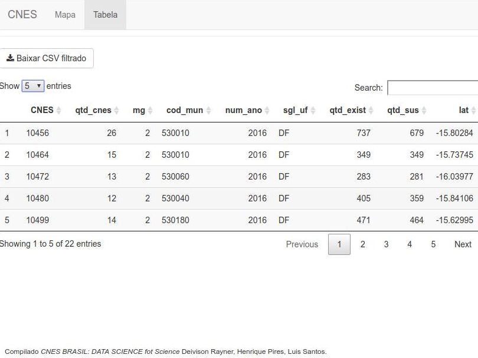

## Dados Censitários

### REST
API_URL
```javascript
<HOSTNAME>/api/censogeo/5300108?format=csv&cache=true&incluirRenda=true
    
<HOSTNAME>/api/estabelecimentos/5300108/all?format=csv&cache=true
```
### Pacotes
```r
if(!require(httr))  install.packages("httr")
if(!require(dplyr))  install.packages("dplyr")
if(!require(ggplot2)) install.packages("ggplot2")
```

### GET

```r
df <- read.table(file = "<API_URL>", sep = ",", quote = "\"", dec = ".", header = TRUE);
```
```r
## if(!require(RCurl)) library(RCurl)

## download.file("<DIR>", destfile = file.path("dados", "cnes_estabelecimentos.csv"))
## df <- read.table(file = file.path("dados", "cnes_estabelecimentos.csv"), sep = ",", quote = "\"", dec = ".", header = TRUE);

```

### Rotas

<pre>
1. Pesquisa Agregada do Censo
    /api/censo/<nome_do_agregado>/<ibge_municipio>?format=(json|csv)
    /api/censo/domicilio01/5300108
      
2. Pesquisa de Estabelecimento 
    /api/estabelecimentos/<ibge_municipio>/(tipo_unidade|all)
    /api/estabelecimentos/5300108/all
      
3. Pesquisa de Setores Censitarios
    /api/censogeo/(ibge_municipio)?incluirRenda=(true|false)
    /api/censogeo/5300108?incluirRenda=true
</pre>


### Shiny

```r
  ui <- bootstrapPage (
    	   ##(...)
	)
```

```r
  server <- function(input, output, session) {
    	   ##(...)
	)
```

## Server

O servidor disponibiliza uma estrutura de visualização e consultas para identificação dos CNEs conforme iamgem abaixo:

<p align="center">
  
</p>


O servidor disponibiliza os dados filtrados para download do *dataset* em CSV conforme imagem abaixo:

<p align="center">
  
</p>
